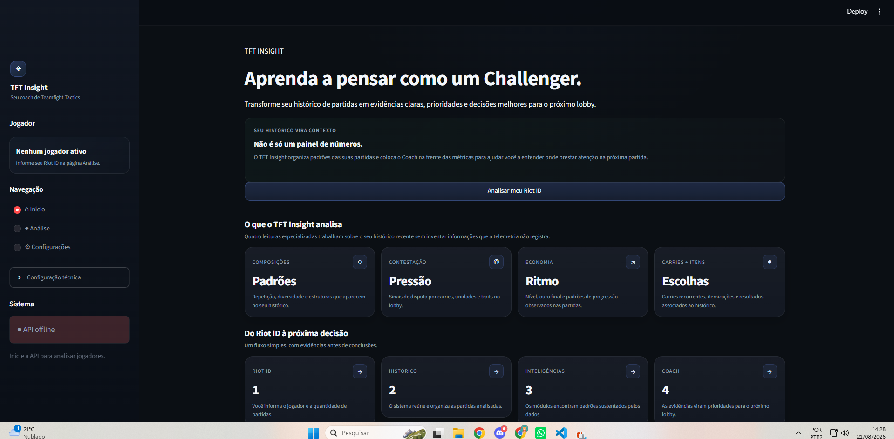
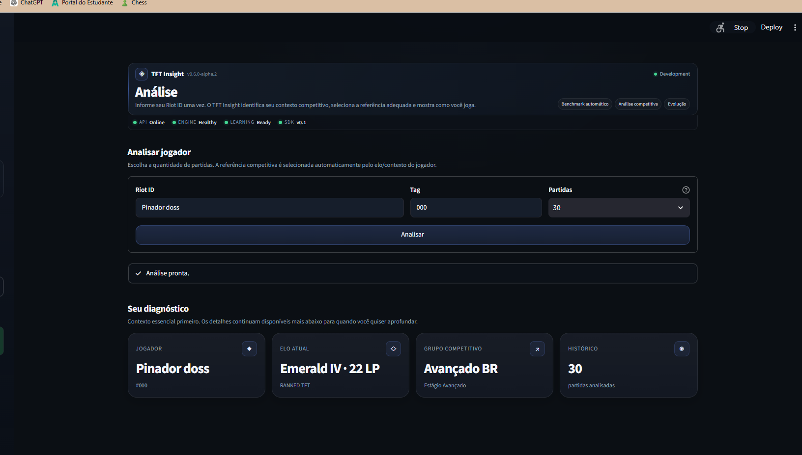

<div align="center">

# TFT Insight

### Aprenda a pensar como um Challenger.

**Plataforma de análise e coaching para Teamfight Tactics baseada em evidências do histórico de partidas.**

Transforma dados históricos e pós-partida em contexto estratégico, prioridades de aprendizado e ações objetivas para as próximas partidas.

</div>

<p align="center">
  
  
  
  
  
</p>

<table>
<tr>
<td width="25%" valign="top">

### 🧩 Composições

Padrões de repetição, diversidade e estruturas usadas no histórico recente.

</td>
<td width="25%" valign="top">

### ⚔️ Contestação

Padrões históricos de disputa por carries, unidades e traits associados às partidas analisadas.

</td>
<td width="25%" valign="top">

### 💰 Economia

Ritmo de progressão, nível, ouro final e padrões econômicos observáveis.

</td>
<td width="25%" valign="top">

### 🎯 Carries + Itens

Carries recorrentes, itemizações e evidências associadas aos resultados.

</td>
</tr>
</table>

<table>
<tr>
<td width="33%" valign="top">

### 🧠 Evidence-first

O sistema parte de telemetria e evidências antes de produzir uma recomendação.

</td>
<td width="33%" valign="top">

### 🧭 Coach orientado ao aprendizado

As inteligências alimentam uma prioridade prática de aprendizado para as próximas partidas.

</td>
<td width="33%" valign="top">

### 🛡️ Guardrails

Limitações da telemetria permanecem explícitas e a narrativa não inventa decisões.

</td>
</tr>
</table>

---

## Sobre o projeto

O **TFT Insight** nasceu com uma ideia simples: estatísticas sozinhas não ensinam um jogador a tomar decisões melhores.

A plataforma analisa o histórico recente de um jogador de Teamfight Tactics e organiza os dados em leituras estratégicas. Em vez de apenas exibir métricas, o sistema procura padrões, combina evidências, identifica prioridades de aprendizado e transforma essas conclusões em orientações para as próximas partidas.

O projeto possui frontend em **Streamlit**, backend em **FastAPI** e uma arquitetura interna separada em camadas de análise, inteligência, aprendizado e treinamento.

> **Princípio do projeto:** a IA pode narrar uma decisão, mas não deve inventar os dados nem substituir a lógica determinística que chegou até ela.

---

## O que o TFT Insight analisa

A experiência atual organiza a análise em quatro inteligências principais:

| Inteligência | O que observa |
|---|---|
| **Composições** | Repetição, diversidade e padrões de composição presentes no histórico |
| **Contestação** | Disputa por carries, unidades e traits durante as partidas |
| **Economia** | Nível, ouro final e padrões de progressão |
| **Carries + Itens** | Carries recorrentes, itemizações e resultados associados ao histórico |

Essas leituras não funcionam isoladamente. Elas alimentam um pipeline de coaching que procura transformar evidências em uma prioridade prática.

---

## Do histórico ao próximo aprendizado

```text
Riot ID
   │
   ▼
Histórico de partidas
   │
   ▼
Player Analysis
   │
   ▼
Skill Mapping
   │
   ▼
Inspector
   │
   ▼
Coach Context
   │
   ▼
Habits
   │
   ▼
Skill Signals
   │
   ▼
Evidence Fusion
   │
   ▼
Learning Priority
   │
   ▼
Training Plan
   │
   ▼
Training Mission
   │
   ▼
Coach Report
```

O objetivo desse fluxo é separar claramente três responsabilidades:

**dados históricos → análise → aprendizado → comunicação**

Os dados históricos observados sustentam a análise; os engines determinísticos escolhem prioridades de aprendizado; a camada de narrativa apresenta o resultado de forma mais natural.

---

## Principais recursos

- Análise de histórico recente por **Riot ID**.
- Comparação do jogador com benchmarks internos.
- Contexto estratégico de **composição, contestação, economia e carries/itens**.
- Detecção de hábitos a partir das evidências disponíveis.
- Mapeamento de hábitos para sinais de habilidade.
- Fusão de diferentes evidências antes da definição de prioridade.
- Seleção de uma prioridade oficial de aprendizado.
- Geração de plano e missão de treinamento.
- Cache de partidas para reduzir chamadas repetidas.
- Interface responsiva com estados de loading, empty state e tratamento de erros.
- Narrativa local opcional com fallback determinístico.

---

## Demonstração

A interface foi desenhada para apresentar primeiro o contexto e a prioridade de aprendizado, mantendo os detalhes disponíveis para aprofundamento quando necessário.

### Home

<p align="center">
  
</p>

### Análise do jogador

<p align="center">
  
</p>

---

## Dados, uso e Fair Play

O **TFT Insight** é projetado como uma ferramenta de análise, aprendizado e acompanhamento de desempenho.

Na versão atual, o produto utiliza dados de histórico e pós-partida para gerar estatísticas, diagnósticos, benchmarks, prioridades de aprendizado, planos e missões de treinamento.

O projeto segue estes princípios:

- não automatiza gameplay nem executa ações no cliente do jogo;
- não controla mouse, teclado ou decisões do jogador;
- não utiliza seus módulos de coaching para fornecer instruções de decisão em tempo real durante uma partida ativa;
- não apresenta informações como certas quando a fonte de dados não as fornece;
- utiliza integrações e dados somente dentro das permissões e políticas aplicáveis;
- qualquer integração futura com eventos suportados por plataformas como Overwolf será implementada de acordo com as políticas da **Riot Games** e da própria plataforma.

O objetivo do TFT Insight é ajudar o jogador a **entender seu desempenho após as partidas e evoluir ao longo do tempo**, e não substituir suas decisões durante o jogo.

---

## Arquitetura

```text
TFT Insight
│
├── partner_platform/          # Interface Streamlit
│   ├── components/            # Componentes visuais
│   ├── navigation/            # Catálogo e navegação
│   ├── pages/                 # Páginas da plataforma
│   ├── platform_core/         # Contexto, router e base da UI
│   ├── services/              # Clientes e serviços da interface
│   └── session/               # Estado da sessão
│
├── src/
│   ├── coach/                 # Orquestração do coaching
│   ├── inspector/             # Inspeção das habilidades
│   ├── integration_engine/    # API e integração dos dados
│   ├── learning/              # Hábitos, sinais, fusão e prioridades
│   ├── services/              # Serviços de análise
│   └── training/              # Planos e missões de treinamento
│
├── scripts/                   # Diagnósticos e suíte de validação
├── docs/                      # Documentação técnica
├── run_api.py                 # Entrypoint FastAPI
└── requirements.txt
```

A aplicação atual utiliza a **Partner Platform** como interface principal.

---

## Stack

**Backend e domínio**

- Python
- FastAPI
- Uvicorn
- Pydantic

**Frontend e visualização**

- Streamlit
- Plotly

**Dados e integração**

- Pandas
- Requests
- HTTPX

**Configuração**

- python-dotenv

O projeto também possui suporte a uma camada de narrativa local quando configurada no ambiente. A lógica de decisão permanece independente dessa camada.

---

## Executando localmente

### 1. Clone o repositório

```bash
git clone https://github.com/matheuspaleari/TFT-Insight.git
cd TFT-Insight
```

### 2. Crie um ambiente virtual

No Windows:

```powershell
python -m venv .venv
.\.venv\Scripts\Activate.ps1
```

### 3. Instale as dependências

```powershell
pip install -r requirements.txt
```

### 4. Configure o ambiente

O projeto utiliza variáveis de ambiente para configurações e credenciais necessárias às integrações.

Crie o arquivo `.env` localmente e mantenha credenciais fora do Git.

### 5. Inicie a API

```powershell
python run_api.py
```

Por padrão, a API é iniciada em:

```text
http://127.0.0.1:8000
```

### 6. Inicie a interface

Em outro terminal:

```powershell
python scripts\run_partner_platform.py
```

O Streamlit abrirá a aplicação no navegador.

---

## Validação do projeto

O TFT Insight possui uma suíte consolidada de validação.

### Validação rápida

Indicada durante desenvolvimento:

```powershell
python scripts\validate_51_roadmap24_official_suite.py --profile quick
```

Ela verifica arquivos críticos, sintaxe Python, imports centrais e grafos de dependência da plataforma.

### Validação completa

Indicada antes de mudanças estruturais ou publicação:

```powershell
python scripts\validate_51_roadmap24_official_suite.py --profile full
```

### Validação completa + guardrails

```powershell
python scripts\validate_51_roadmap24_official_suite.py --profile full --guardrails
```

A suíte oficial foi criada para responder a uma pergunta simples:

> **A camada pública do TFT Insight continua íntegra depois desta mudança?**

---

## Guardrails

O projeto foi construído com alguns princípios importantes:

- não transformar ausência de telemetria em certeza;
- não inventar informações que a fonte de dados não fornece;
- separar evidência de interpretação;
- preservar confiança e limitações quando aplicável;
- manter decisões importantes em código determinístico;
- usar narrativa como apresentação, não como fonte da decisão;
- tratar falhas de API sem expor dumps técnicos ao usuário final.

Esses contratos são cobertos por auditorias e testes automatizados do projeto.

---

## Estado atual

O TFT Insight está em **desenvolvimento ativo**.

A base atual já possui:

- interface principal consolidada;
- backend de integração;
- pipeline de coaching;
- inteligências estratégicas;
- sistema de aprendizado e treinamento;
- tratamento de estados e erros;
- suíte oficial de validação;
- guardrails de produto;
- limpeza e consolidação arquitetural em andamento.

As próximas etapas estão concentradas na evolução do produto, documentação, consolidação da arquitetura e avaliação de integrações oficialmente suportadas, sempre sujeitas às políticas aplicáveis da Riot Games e das plataformas utilizadas.

---

## Motivação técnica

Além do produto em si, o TFT Insight é um projeto de estudo e aplicação prática de conceitos de:

- engenharia de software;
- arquitetura em camadas;
- APIs;
- processamento e interpretação de dados;
- sistemas baseados em evidências;
- regras determinísticas;
- observabilidade e tratamento de falhas;
- integração de IA local com guardrails;
- testes e evolução incremental de produto.

---

## Autor

**Matheus Paleari**

Projeto desenvolvido como iniciativa independente de estudo, engenharia e produto.

---

## Aviso

TFT Insight é um projeto independente e não possui afiliação oficial com a Riot Games.

A versão atual é focada em **análise histórica e pós-partida**, aprendizado e acompanhamento de desempenho. O TFT Insight não automatiza gameplay, não controla o cliente do jogo e não utiliza seus módulos de coaching para fornecer instruções de decisão em tempo real durante uma partida ativa.

Integrações futuras com APIs ou provedores de eventos suportados serão implementadas de acordo com as políticas e permissões aplicáveis da Riot Games e das respectivas plataformas.

Teamfight Tactics e Riot Games são marcas de seus respectivos proprietários.
