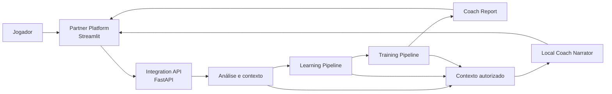
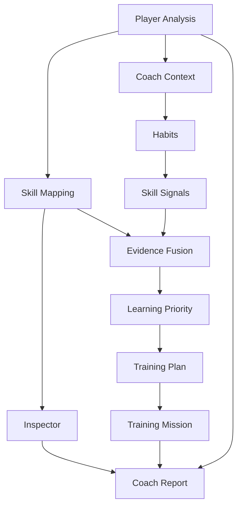
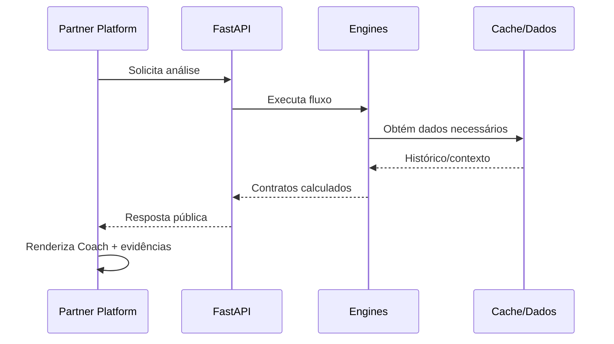
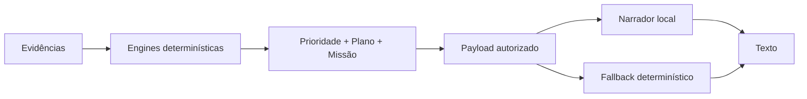

# Arquitetura do TFT Insight

Este documento descreve a arquitetura atual do TFT Insight e os limites entre interface, integração, análise, aprendizado, treinamento e narrativa.

> A regra central da arquitetura é simples: **dados e regras determinísticas produzem a decisão; a camada de narrativa apenas comunica uma decisão já produzida.**

---

## Visão geral

O TFT Insight transforma o histórico recente de um jogador de Teamfight Tactics em contexto competitivo, evidências, prioridades de aprendizado e uma missão prática de treinamento.

A aplicação é organizada em duas grandes superfícies:

- `partner_platform/`: interface Streamlit e camada de apresentação;
- `src/`: domínio, integração, análise, aprendizado e treinamento.

A API FastAPI expõe a camada de integração para a interface.



---

## Fluxo principal de coaching

O `CoachEngine` coordena o fluxo pedagógico principal.



### 1. Player Analysis

Responsável pela análise base do jogador.

Entrada principal:

- Riot ID;
- tag;
- benchmark opcional;
- quantidade de partidas;
- política de cache.

A saída fornece o contexto necessário para as etapas seguintes, incluindo performance e identificação do jogador.

### 2. Skill Mapping

`SkillMappingService` converte a performance observada em avaliações de habilidades.

Essa etapa estrutura sinais técnicos em um contrato que pode ser consumido pelo Inspector e pelo pipeline de aprendizado.

### 3. Inspector

`InspectorEngine` inspeciona as avaliações e a performance para produzir leituras explicáveis das habilidades.

O Inspector complementa a análise; ele não substitui o pipeline de prioridade pedagógica.

### 4. Coach Context

`BenchmarkCoachContextBuilder` organiza evidências estratégicas obtidas do histórico.

O contexto atual inclui inteligências como:

- composição;
- contestação;
- economia;
- carries e itens.

As partidas podem ser obtidas por `CachedMatchService`, reduzindo leituras repetidas da mesma informação.

### 5. Habits

`HabitEngine` procura padrões recorrentes sustentados pelo `coach_context`.

O objetivo é representar comportamento observável sem transformar ausência de telemetria em certeza.

### 6. Skill Signals

`HabitSkillMappingService` converte hábitos detectados em sinais relacionados às habilidades do modelo de aprendizado.

### 7. Evidence Fusion

`SkillEvidenceFusionService` combina:

- avaliações provenientes da análise;
- sinais provenientes dos hábitos.

A fusão evita que uma única fonte seja tratada automaticamente como verdade suficiente para definir o foco pedagógico.

### 8. Learning Priority

`LearningPriorityEngine` recebe as evidências fundidas e constrói o plano de prioridades.

Essa é uma das fronteiras mais importantes do sistema: a prioridade oficial é escolhida pela lógica do TFT Insight, não pelo narrador local.

### 9. Training Plan

`TrainingPlanEngine` transforma a prioridade aprovada em um plano de treinamento acionável.

O plano pode incluir:

- habilidade principal;
- objetivo;
- exercício;
- checklist;
- focos secundários;
- forças a preservar;
- contextos a observar;
- quantidade alvo de partidas.

### 10. Training Mission

`PlayerTrainingService` cria ou recupera a missão associada ao plano.

Quando existe um `TrainingPlan`, a missão é criada a partir dele. O caminho legado de recomendação permanece apenas como fallback de compatibilidade quando uma prioridade oficial não pode ser produzida.

### 11. Coach Report

`CoachReport` agrega os contratos necessários para consumo pelas interfaces existentes.

O relatório preserva compatibilidade com partes legadas enquanto o pipeline novo assume a decisão pedagógica.

---

## Partner Platform

A interface atual está em `partner_platform/`.

```text
partner_platform/
├── app.py
├── components/
├── intelligence/
├── navigation/
├── pages/
├── platform_core/
├── services/
└── session/
```

### Responsabilidades

**`app.py`**

Entrypoint da aplicação Streamlit.

**`pages/`**

Páginas públicas da experiência, incluindo Home, Análise/Benchmark e Configurações.

**`platform_core/`**

Contratos estruturais da interface, como contexto de página, roteamento e base compartilhada.

**`navigation/`**

Catálogo e definição da navegação ativa.

**`components/`**

Componentes visuais reutilizáveis.

**`services/`**

Comunicação da interface com a API e serviços necessários à apresentação.

**`session/`**

Estado persistido durante a sessão Streamlit.

**`intelligence/`**

Adaptação e apresentação de inteligências para a interface, incluindo a narrativa local.

---

## API e integração

A API é iniciada por:

```text
run_api.py
    ↓
src.integration_engine.api.app
```

O entrypoint utiliza FastAPI/Uvicorn e mantém a integração separada da Partner Platform.

A interface não deve duplicar regras de domínio que pertencem à Engine. Ela solicita os contratos necessários e os transforma em experiência visual.



---

## Determinístico vs. narrativa local

Esta separação é um guardrail arquitetural.

### Camada determinística

É responsável por:

- analisar dados;
- calcular métricas;
- construir contexto;
- detectar hábitos;
- mapear sinais;
- fundir evidências;
- escolher prioridades;
- construir plano;
- definir missão;
- autorizar forças e sinais complementares.

### Narrador local

`LocalCoachNarrator` recebe apenas informações já calculadas e autorizadas.

Ele pode:

- organizar as conclusões;
- melhorar fluidez;
- transformar contratos estruturados em texto amigável.

Ele não pode:

- recalcular métricas;
- escolher uma nova prioridade;
- contradizer a prioridade oficial;
- inventar evidências;
- promover um sinal complementar a decisão principal.

Quando o narrador local não responde ou sua saída não é aceita, a interface usa uma narrativa determinística de fallback.



---

## Narrativa local

A implementação atual suporta um narrador local configurável por ambiente.

O projeto possui configuração padrão para um endpoint Ollama local e um modelo local, mas a disponibilidade do narrador não é requisito para que a lógica de coaching funcione.

Essa decisão mantém:

- os cálculos independentes do modelo de linguagem;
- fallback quando o serviço local estiver indisponível;
- decisões reproduzíveis;
- menor risco de alucinação alterar o resultado do produto.

---

## Cache

`CachedMatchService` participa do fluxo de coaching para reaproveitar partidas já obtidas quando permitido.

O cache é uma otimização de integração. Ele não deve alterar o significado das evidências nem a decisão do pipeline.

---

## Contratos e compatibilidade

O projeto evoluiu em várias roadmaps e ainda preserva alguns contratos de compatibilidade.

Um exemplo é `LearningRecommendation`: ele pode continuar presente em `CoachReport` para interfaces existentes, mas não é mais a fonte principal da missão quando o novo `TrainingPlan` está disponível.

A política arquitetural é:

1. introduzir o contrato novo;
2. preservar compatibilidade onde necessário;
3. migrar consumidores;
4. remover o legado somente após auditoria e smoke test.

---

## Guardrails arquiteturais

### Evidência antes de conclusão

Uma mensagem de Coach deve estar sustentada por dados ou contratos produzidos pelas Engines.

### Ausência de dado não é evidência

Quando a telemetria não permite afirmar algo, a camada de apresentação deve preservar essa limitação.

### Prioridade é única e explícita

Sinais de composição, contestação, economia ou benchmark podem contextualizar a decisão, mas não devem competir silenciosamente com a prioridade oficial produzida pelo pipeline de aprendizado.

### Falhas são isoladas

Uma inteligência específica pode falhar sem necessariamente invalidar todas as outras leituras disponíveis.

### Detalhes técnicos não vazam para o usuário

Erros internos podem ser registrados e diagnosticados, mas a UI deve apresentar estados de produto apropriados.

### IA narra; Engine decide

A camada de linguagem é opcional e subordinada aos contratos determinísticos.

---

## Estrutura de alto nível

```text
TFT Insight
│
├── partner_platform/              # apresentação
│
├── src/
│   ├── coach/                     # orquestração do coaching
│   ├── inspector/                 # inspeção de habilidades
│   ├── integration_engine/        # API, cache e integração
│   ├── learning/                  # hábitos, sinais, fusão e prioridade
│   ├── services/                  # análise do jogador
│   └── training/                  # plano e missão
│
├── scripts/                       # testes, auditorias e validação oficial
├── docs/                          # documentação técnica
├── data/                          # dados locais necessários ao projeto
├── run_api.py                     # entrypoint da API
└── requirements.txt
```

Outros módulos de domínio podem existir em `src/` para capacidades específicas. Este documento enfatiza o caminho principal atualmente exposto pela experiência pública e pelo pipeline de coaching.

---

## Validação da arquitetura

Mudanças estruturais devem ser seguidas pela suíte oficial:

```powershell
python scripts\validate_51_roadmap24_official_suite.py --profile full --guardrails
```

A documentação possui também uma auditoria de contrato própria:

```powershell
python scripts\validate_53_roadmap24_architecture.py
```

A validação documental não substitui testes funcionais; ela garante que os principais limites e componentes arquiteturais continuem explicitamente documentados.

---

## Direção arquitetural

A evolução do TFT Insight deve continuar priorizando:

- contratos explícitos entre camadas;
- dependências em uma direção clara;
- regras de produto testáveis;
- separação entre cálculo e apresentação;
- isolamento de integrações externas;
- remoção controlada de legado;
- documentação sincronizada com o caminho público real.

O objetivo não é maximizar o número de Engines, e sim manter claro **quem observa, quem decide e quem comunica**.
